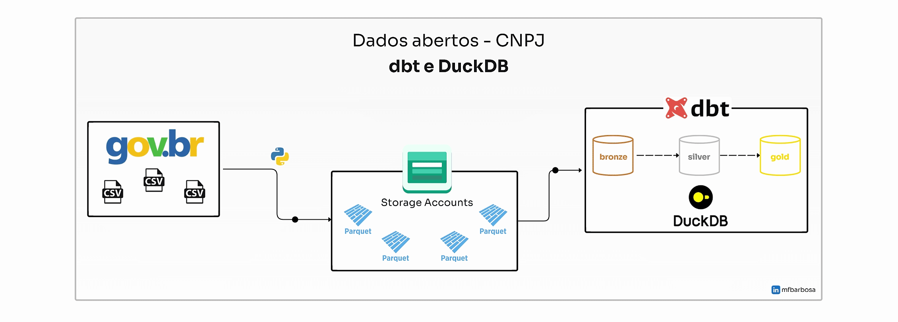

# Cadastro Nacional da Pessoa Jurídica - CNPJ

Transformação de dados abertos do Cadastro Nacional da Pessoa Jurídica - CNPJ com dbt e DuckDB.

O intuito inicial desse projeto foi colocar em prática o uso do DuckDB depois de assistir a palestra "O Patinho no Lago de Dados", do Professor Danilo Santos no Data Saturday BH. O conteúdo da palestra está disponível no repositório do git [profdanilosantos](https://github.com/profdanilosantos/duckdb_data_saturday_2024_belohorizonte).

Para complementar a stack, utilizei o dbt para fazer a transformação dos dados.



## Origem dos dados

Os dados estão disponíveis no portal [dados abertos - CNPJ](https://dados.gov.br/dados/conjuntos-dados/cadastro-nacional-da-pessoa-juridica---cnpj), eles são mantidos pela Receita Federal do Brasil, com atualizações mensais.

Para fazer o download acesse a aba `Recursos` na opção `DADOS ABERTOS CNPJ`. Eles estão agrupados por ano e mês, compactados em formato `.zip`. Ao extrair, você encontrará um arquivo `.csv` em cada.

## Configuração do ambiente

Para rodar o projeto precisamos ter o Python instalado. 

Criar um ambiente virtual:

```bash
python -m venv dbt_env
```
Ativar o ambiente:

```bash
source dbt_env/bin/activate
```

E instalar as dependências que estão mapeadas no arquivo `requirements.txt`:

```bash
pip install -r requirements.txt
```


## Convertendo os arquivos CSV para parquet

Para ter um arquivo menor para armazenar em uma conta de armazenamento, converti os arquivos `.csv` para `.parquet`. O código python abaixo é um exemplo de como fazer essa conversão.

```python
import pandas as pd
import pyarrow as pa
import io
import pyarrow.parquet as pq

df = pd.read_csv('caminho/arquivo.csv', header=None, encoding='latin1', sep=';', quotechar='"')

# Converte o DataFrame para Parquet
table = pa.Table.from_pandas(df)
parquet_path = 'caminho/arquivo.parquet'
pq.write_table(table, parquet_path)

print(f"Arquivo Parquet salvo em: {parquet_path}")
```

## Configurando o profile do dbt

Nesse exemplo foi utilizado o armazenamento de Blob da Azure, para conseguir conectar na conta de armaenamento é necessário configurar o profile do dbt. O arquivo `profiles.yml` normalmente está na pasta `~/.dbt/`.

Substitua os valores de `AccountName` e `AccountKey` no parametro `azure_storage_connection_string` pelos valores da sua conta de armazenamento.

```
dados_abertos_cnpj:
  target: dev
  outputs:
    dev:
      type: duckdb
      path: ~/dbt/dados_abertos_cnpj/dbt.duckdb
      schema: cnpj
      extensions:
        - azure
        - parquet
      settings:
        azure_storage_connection_string: "DefaultEndpointsProtocol=https;AccountName=nome_conta_armazenamento;AccountKey=chave_acesso"
```

## Mapeando os sources 

No arquivo `models/sources/__source.yml` estão mapeados os arquivos `.parquet` de origem utilizados no projeto. No exemplo existe um container chamado `cnpj` onde todos os arquivos estão armazenados. 

Cada tabela é mapeada com base no valor que aparece no `external_location`. No trecho abaixo, a tabela `simples` é carregada buscando por todos arquivos que contenham `*SIMPLES*` no nome.

```
sources:
  - name: external_source
    meta:
      external_location: "read_parquet('azure://cnpj/{name}.parquet')"
    tables:
      - name: simples
        config:
          external_location: "read_parquet('azure://cnpj/*SIMPLES*.parquet')"
```

## Executando o projeto:

Para rodar o projeto, acesse a pasta raiz do projeto `dados_abertos_cnpj` e execute o comando abaixo:

```bash
dbt build
```
